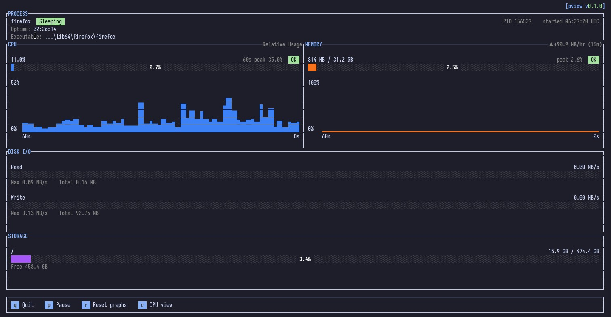
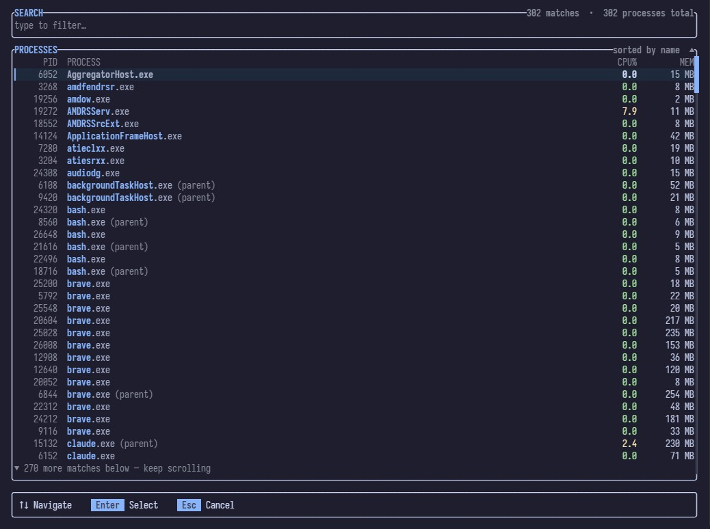

# pview

A terminal UI for watching a single process in real time — CPU, memory, disk I/O, and process metadata, updated live. Think `htop`, but scoped to exactly the one process you care about.

Built with [ratatui](https://github.com/ratatui-org/ratatui), [crossterm](https://github.com/crossterm-rs/crossterm), [clap](https://github.com/clap-rs/clap), and [sysinfo](https://github.com/GuillaumeGomez/sysinfo).

## Screenshots




## Features

- **Live CPU and memory graphs** — sparkline charts with a rolling time window (e.g. last 60s), plus a peak-since-start reading and an at-a-glance health badge (OK / HIGH / CRIT), both always reading as a percentage of total capacity (all cores / all system RAM) so they stay meaningful regardless of display mode. Memory's graph and value both track % of total RAM. The CPU panel cycles (`c`) through three views, shown in the panel title: **System Usage** (% of one core, can exceed 100% on multi-core machines, fixed 0-100% graph axis), **Core Usage** (the same value in cores, e.g. 250% ↔ 2.5 cores, graph axis auto-fits to the visible window's peak rounded up to the next whole core), and **Relative Usage** (percent again, but the graph axis tops out at the visible window's peak plus 50% headroom instead of a fixed 100%, so current usage is shown relative to the recent peak instead of hugging the top of the chart whenever it's close to it).
- **Memory trend** — a `▲/▼/► ±X MB/hr` badge on the Memory panel, tracking drift over up to the last hour so slow leaks are visible without watching the graph.
- **Disk I/O** — current read/write rate as a gauge against the session peak, plus cumulative totals for the monitoring session.
- **Storage** — used vs. total capacity of the disk backing the process's executable, with a gauge and free-space total.
- **Process info** — status, PID, start time, uptime, and executable path.
- **Interactive process picker** — run `pview` with no arguments to fuzzy-search running processes and pick one interactively, no need to know the exact name or PID up front. Shows live CPU%/MEM per process, sorted alphabetically by name so rows don't jump around as usage changes.
- **Pause and reset** — freeze the display to inspect a moment, or clear the graphs and start a fresh window without restarting.
- **Configurable refresh rate** — default 1s, configurable from 250ms to 1s.

## Installation

Requires a recent [Rust toolchain](https://rustup.rs/).

```bash
git clone https://github.com/Blathe/pview.git
cd pview
cargo build --release
```

The binary is built to `target/release/pview` (`pview.exe` on Windows).

## Usage

```bash
# Interactive picker — fuzzy-search running processes and select one
pview

# Monitor by exact process name (case-insensitive)
pview explorer.exe

# Monitor by PID
pview 12345

# Custom refresh interval (250-1000 milliseconds)
pview explorer.exe --interval 250
pview explorer.exe -i 250
```

If a name matches more than one running process, `pview` opens the same interactive picker, pre-filtered to what you typed, so you can pick the exact instance you meant.

## Keybindings

**Dashboard**

| Key | Action |
| --- | --- |
| `q` | Quit |
| `p` | Pause / resume the display |
| `r` | Reset the CPU/memory graph history |
| `c` | Toggle CPU view between % of one core and cores used |

**Process picker**

| Key | Action |
| --- | --- |
| Type | Filter the process list |
| `↑` / `↓` | Move the selection |
| `Enter` | Monitor the selected process |
| `Esc` | Cancel and exit |

## Platform notes

`pview` is built on `sysinfo` for cross-platform process stats, but has primarily been developed and tested on Windows. Some fields (e.g. executable path, disk I/O, or process start time) may be unavailable for processes you don't own without elevated privileges, depending on the OS.
